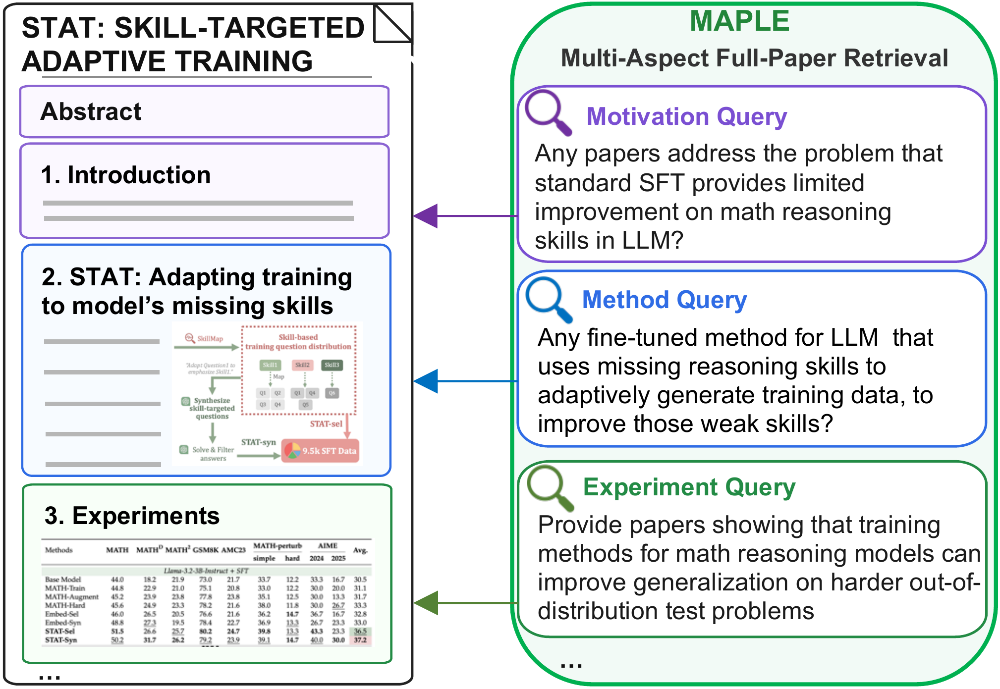

# MAPLE

This repository contains the index and evaluation code for MAPLE benchmark: an expert-validated benchmark for multi-aspect full-paper retrieval, which contains 2,095 fine-grained queries derived from 210 recent machine learning papers. Each target paper is paired with multiple queries grounded in textual or multimodal evidence and covering different aspects of the paper, including motivation, method, and experimental findings. This many-query-to-one-paper design evaluates whether retrievers can consistently recover the same paper across a diverse set of aspect-focused queries.

<p align="center">
  
</p>

## MAPLE-Synth

[MAPLE-Synth](MAPLE-Synth/) is a self-contained pipeline for downloading OpenReview papers, filtering and summarizing them, generating multi-aspect queries, analyzing query quality, and mining hard-negative papers (Stages 0–5). It is separate from the retrieval indexing and evaluation code.

See the [MAPLE-Synth setup guide](MAPLE-Synth/README.md) for installation, configuration, BGE-M3 download, ICL database preparation, and end-to-end run commands.

## Download Data

```bash
huggingface-cli download kai-02/MAPLE --repo-type dataset --local-dir data/MAPLE
export MAPLE_DATA_ROOT=data/MAPLE
```

<!-- 
Self-contained experiment runners for MAPLE. The code here builds local indexes, runs retrieval experiments, aggregates MAPLE-1Q scores, optionally generates screenshots from released PDF shards, and talks to embedding models through HTTP services. -->

<!-- The experiment code does not write to Postgres and does not load embedding models directly. -->
<!-- 
## Quickstart With Cached Indexes

Use this path if you only want to reproduce scores and do not want to rebuild embeddings.

```bash
conda env create -f envs/maple-evaluation.yml
conda activate maple-evaluation

huggingface-cli download kai-02/MAPLE --repo-type dataset --local-dir data/MAPLE
export MAPLE_DATA_ROOT=data/MAPLE
export MAPLE_CACHE_ROOT=data/MAPLE/cached_index
```

Run one cached multi-aspect result:

```bash
python -m evaluations.multi_aspect.experiment \
  fulltext-gritlm-7b \
  --online-cached-index true \
  --output-dir outputs/experiments/multi_aspect/fulltext-gritlm-7b
```

Run one cached representation result:

```bash
python -m evaluations.representation.experiment \
  paper-gritlm-fulltext \
  --online-cached-index true \
  --output-dir outputs/experiments/representation/paper-gritlm-fulltext
```

Aggregate MAPLE-1Q over completed multi-aspect result directories:

```bash
python -m evaluations.maple_1q.experiment \
  --results-root outputs/experiments/multi_aspect \
  --output-dir outputs/experiments/maple_1q
``` -->

<!-- Cached BM25 scoring requires the cached Lucene `index_dir`. Dense cached scoring only needs the released embedding files. -->

<!-- ## Data Layout

After downloading the HF release, the expected layout is:

```text
data/MAPLE/
  corpus/
  pdf_shards/
  queries/
  representations/{abstract,fulltext,interleaved_ocr}/
  cached_index/
data/MAPLE_preprocessed/
  screenshots/
indexes/
outputs/experiments/
```

Common path overrides:

```bash
export MAPLE_DATA_ROOT=data/MAPLE
export MAPLE_PREPROCESSED_ROOT=data/MAPLE_preprocessed
export MAPLE_CACHE_ROOT=data/MAPLE/cached_index
``` -->

## Code Structure

- `MAPLE-Synth/`: self-contained query-generation and hard-negative-mining pipeline; see its [README](MAPLE-Synth/README.md).

- `evaluations/multi_aspect/`: index and experiment for multi-aspect retrieval.
- `evaluations/representation/`: index and experiment for paper-level and chunk-level representation retrieval.
- `evaluations/maple_1q/`: MAPLE-1Q experiment for the one-query-to-one-paper setting.
- `utils/`: JSONL I/O, metrics, BM25 wrapper, dense index files, chunking, cached-index loading, embedding policies, and PDF-to-screenshot helpers.
- `retrievers/models/`: HTTP embedding model servers.
- `retrievers/launch_script/`: embedding model service launchers.
- `envs/`: conda environment files.


## Environments

Use separate conda environments. The model stacks have conflicting dependencies, so do not install every model into one Python env.

| Env | Purpose | Install |
|---|---|---|
| `maple-evaluation` | CLI, cached scoring, BM25, preprocessing | `conda env create -f envs/maple-evaluation.yml` |
| `maple-text` | SPECTER2, SciNCL, Instructor-XL, Qwen3-Embed, Qwen3-VL | `conda env create -f envs/maple-text.yml` |
| `maple-bge` | BGE-M3 service | `conda env create -f envs/maple-bge.yml` |
| `maple-gritlm` | GritLM-7B service | `conda env create -f envs/maple-gritlm.yml` |
| `maple-vlm` | Ops-MM service | `conda env create -f envs/maple-vlm.yml` |

BM25 uses Pyserini/Lucene, so `maple-evaluation` must expose both `java` and `javac`:

```bash
conda activate maple-evaluation
java -version
javac -version
```
<!-- 
If `javac` is missing, install OpenJDK:

```bash
conda install -c conda-forge openjdk
``` -->

## Build Indexes

Dense indexes require a live HTTP service. The recommended workflow is:

1. Start one model service.
2. Run the matching `index` command.
3. Move to the next model.

Service launch examples:

```bash
bash retrievers/launch_script/start_bge_m3.sh --gpu 0 --port 18080 --env-name maple-bge
bash retrievers/launch_script/start_multi_model.sh --gpu 0 --port 18081 --env-name maple-text
bash retrievers/launch_script/start_gritlm.sh --gpu 0 --port 18082 --env-name maple-gritlm
bash retrievers/launch_script/start_qwen3_embed.sh --gpu 0 --port 18087 --env-name maple-text
bash retrievers/launch_script/start_qwen3_vl.sh --gpu 0 --port 18086 --env-name maple-text
bash retrievers/launch_script/start_ops_mm.sh --gpu 0 --port 18088 --env-name maple-vlm
```

Endpoint mapping:

| Model | Service URL |
|---|---|
| `bm25` | no service |
| `bge-m3` | `http://127.0.0.1:18080/embed` |
| `specter2` | `http://127.0.0.1:18081/embed/specter2` |
| `scincl` | `http://127.0.0.1:18081/embed/scincl` |
| `instructor-xl` | `http://127.0.0.1:18081/embed/instructor-xl` |
| `gritlm-7b` | `http://127.0.0.1:18082/embed` |
| `qwen3-embed-8b` | `http://127.0.0.1:18087/embed` |
| `qwen3-vl-embed-8b` | `http://127.0.0.1:18086/embed` |
| `ops-mm-embed-7b` | `http://127.0.0.1:18088/embed` |

Text models automatically use the `fulltext` representation. Screenshot models automatically use screenshots. Model paths default to HuggingFace IDs; set variables such as `SCINCL_MODEL_PATH`, `SPECTER2_MODEL_PATH`, `INSTRUCTOR_XL_MODEL_PATH`, `BGE_M3_MODEL_PATH`, `GRITLM_MODEL_PATH`, `QWEN3_EMBED_MODEL_PATH`, `QWEN3_VL_MODEL_PATH`, or `OPS_MM_MODEL_PATH` to use local checkpoints.

Build multi-aspect indexes:

```bash
python -m evaluations.multi_aspect.index --model-name bm25

python -m evaluations.multi_aspect.index \
  --model-name gritlm-7b \
  --service-url http://127.0.0.1:18082/embed
```

Build representation indexes:

```bash
python -m evaluations.representation.index \
  --representation fulltext \
  --level paper \
  --model-name gritlm-7b \
  --service-url http://127.0.0.1:18082/embed

python -m evaluations.representation.index \
  --representation fulltext \
  --level chunk \
  --model-name gritlm-7b \
  --service-url http://127.0.0.1:18082/embed
```

## Experiments
Run experiments from local indexes:

```bash
python -m evaluations.multi_aspect.experiment \
  --index-dir indexes/multi_aspect/gritlm-7b \
  --service-url http://127.0.0.1:18082/embed \
  --output-dir outputs/experiments/multi_aspect/gritlm-7b

python -m evaluations.representation.experiment \
  --index-dir indexes/representation/paper-fulltext-gritlm-7b \
  --service-url http://127.0.0.1:18082/embed \
  --output-dir outputs/experiments/representation/paper-fulltext-gritlm-7b
```

Use the cached index from online hugginface data repository, if you only want to reproduce scores and do not want to rebuild embeddings.

```bash
export MAPLE_CACHE_ROOT=data/MAPLE/cached_index
```

Run one multi-aspect experiment with cached index:

```bash
python -m evaluations.multi_aspect.experiment \
  fulltext-gritlm-7b \
  --online-cached-index true \
  --output-dir outputs/experiments/multi_aspect/fulltext-gritlm-7b
```


<!-- ## Tiny Smoke Test

Use a small subset before launching a full rebuild:

```bash
conda activate maple-evaluation

python -m evaluations.multi_aspect.index \
  --model-name bm25 \
  --max-papers 5 \
  --output-dir indexes/smoke/multi-aspect-bm25

python -m evaluations.multi_aspect.experiment \
  --index-dir indexes/smoke/multi-aspect-bm25 \
  --max-queries 5 \
  --output-dir outputs/experiments/smoke/multi-aspect-bm25
```

For a dense smoke test, start the multi-model service first and use SciNCL:

```bash
bash retrievers/launch_script/start_multi_model.sh --gpu 0 --port 18081 --env-name maple-text

python -m evaluations.multi_aspect.index \
  --model-name scincl \
  --service-url http://127.0.0.1:18081/embed/scincl \
  --max-papers 5 \
  --max-queries 5 \
  --output-dir indexes/smoke/multi-aspect-scincl

python -m evaluations.multi_aspect.experiment \
  --index-dir indexes/smoke/multi-aspect-scincl \
  --service-url http://127.0.0.1:18081/embed/scincl \
  --max-queries 5 \
  --output-dir outputs/experiments/smoke/multi-aspect-scincl
```

Representation uses the same service pattern:

```bash
python -m evaluations.representation.index \
  --representation fulltext \
  --level paper \
  --model-name scincl \
  --service-url http://127.0.0.1:18081/embed/scincl \
  --max-papers 5 \
  --output-dir indexes/smoke/representation-scincl

python -m evaluations.representation.experiment \
  --index-dir indexes/smoke/representation-scincl \
  --service-url http://127.0.0.1:18081/embed/scincl \
  --max-queries 5 \
  --output-dir outputs/experiments/smoke/representation-scincl
``` -->

## Outputs

`multi_aspect` and `representation` write:

- `metrics.json`
- `rankings.jsonl`
- `query_rows.jsonl`
- `table.tsv`

`maple_1q` writes:

- `metrics.json`
- `metrics.csv`
- `metrics.tsv`

MAPLE-1Q reports one row per model with `nDCG@10` and `Recall@20`.


<!-- ## Troubleshooting

- Dense indexing and dense scoring require a live HTTP service and the correct `--service-url`.
- If you use an HTTP proxy, make sure local embedding service calls to `127.0.0.1` or `localhost` bypass the proxy.
- If a model tries to download into a full disk, use a larger HuggingFace cache location or set the corresponding local checkpoint variable such as `INSTRUCTOR_XL_MODEL_PATH`.
- Screenshot indexing may generate missing screenshots from `pdf_shards`; this can take time and disk space.
- BM25 requires Pyserini/Lucene plus `java` and `javac`.
- If a service returns 500, verify that it is running in the matching conda env and using the expected model checkpoint path. -->
